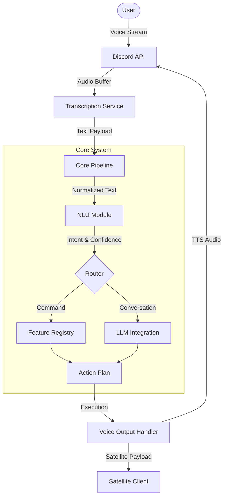

# System Architecture

This document describes the high-level architecture of the Mina system, detailing the data flow and component interactions.

## Overview

Mina is built upon a modular architecture designed to decouple the core processing loop from specific functional implementations. The system operates on a pipeline model where audio input is transformed into actionable intent, processed by feature modules, and executed as output actions.

## System Diagram



## Core Components

### 1. The Processing Pipeline (`src/core/pipeline`)
The Pipeline serves as the central orchestration layer. It accepts transcribed text and context metadata, managing the following process flow:

1.  **Input Validation**: Verification of input integrity and user context.
2.  **Wake Word Detection**: Analysis of the input string for activation phrases.
3.  **Intent Classification**: Delegation to the NLU module to determine the nature of the request (Command vs. Conversation).
4.  **Routing**: dispatching the request to the appropriate Feature Module or AI Generator.
5.  **Output Resolution**: Consolidating the returned `ActionPlan` for execution.

### 2. Action Protocol
The system uses an asynchronous `ActionPlan` protocol. Feature modules do not perform side effects directly. Instead, they return a JSON object defining the requested operations.

**Structure:**
```json
{
  "TTS_SPEAK": "Output text string",
  "AUDIO_SEQUENCE": [
    { "type": "tts", "text": "Playing song" },
    { "type": "sound", "path": "sounds/confirm.mp3" }
  ],
  "LEAVE": false
}
```

This abstraction allows the core system to prioritize, sequence, or modify actions (e.g., suppressing output during 'Do Not Disturb' mode) before execution.

### 3. NLU and AI Integration
*   **Deterministic NLU**: Uses regular expressions and keyword analysis for high-performance, local intent detection of control commands.
*   **Generative AI**: Utilizes external LLMs (via OpenRouter/Gemini APIs) for conversational capability. The prompt construction pipeline injects dynamic context, including:
    *   **Persona**: System behavior definition.
    *   **Memory**: Relevant user facts retrieved via vector search.
    *   **Mood**: Dynamic personality state modifiers.

### 4. Memory Persistence (`src/core/memory`)
The memory system provides state persistence through a local file-based database (`data/memory.json`).
*   **Vector Search**: User interactions and facts are embedded and stored to allow semantic retrieval during conversation generation.
*   **Profile Management**: Stores structured data such as user preferences and historical interactions.

## Directory Organization

*   `src/core/`: Essential system logic (Pipeline, NLU, Memory, VRM).
*   `src/features/`: Functional modules (Gaming, Music, Reminders).
*   `src/integrations/`: Interfaces for external APIs (Discord, AI, Satellite).
*   `commands/`: Slash Command registration logic.
*   `models/`: Local machine learning models (Vosk).
*   `satellite/`: External client application source code.
