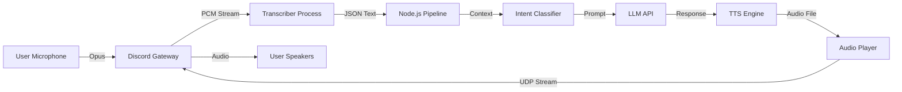

# Voice Pipeline Architecture

This document details the end-to-end data flow of the real-time voice processing system, tracing the path from user speech to system response.

## 1. Audio Ingestion

The ingestion layer handles the connection to Discord's voice servers and the extraction of raw audio streams.

### Voice Connection
*   **Library**: `@discordjs/voice`
*   **Adapter**: Uses the native Discord gateway adapter.
*   **Behavior**: When the bot joins a channel (`src/core/voice/handler.js`), it establishes a UDP connection for audio transport.

### Stream Subscription
For each user in the voice channel (excluding bots and opted-out users):
1.  **Opus Stream**: A `receiver` subscribes to the user's Opus audio packets.
2.  **Decoding**: `prism-media` decodes Opus packets into signed 16-bit PCM (48kHz, 2-channel).
3.  **Silence Detection**: The `EndBehaviorType.AfterSilence` logic cuts the stream after 1 second of silence, demarcating a single "Utterance".

## 2. Transcription Layer

Mina uses a local subprocess model for speech-to-text to ensure low latency and privacy.

### The Subprocess
*   **Module**: `src/integrations/transcription/index.js`
*   **Mechanism**: Spawns a dedicated Python process (`transcribe.py`) for each active speaker.
*   **Data Flow**:
    *   **Stdin**: Node.js pipes the raw PCM audio stream directly to the Python process.
    *   **Stdout**: Python prints JSON objects containing the transcribed text (lines of JSON).
*   **Engine**: Vosk (CPU-optimized) or Faster-Whisper (GPU-optimized), configurable via `.env`.

### Output Handling
The Python script outputs intermediate partial results (ignored) and final results. When a final result is received (`{"text": "Sample text"}`), it is passed to the **Core Pipeline**.

## 3. The Core Pipeline

The pipeline (`src/core/pipeline/handleUtterance.js`) acts as the central router.

### Step 3a: Input Validation
*   **Context**: Enriches the text with metadata: User ID, Guild ID, current visual status (Presence), and channel information.
*   **Wake Word Check**: The `NLU` module checks if the text contains an activation phrase ("Mina", "Nina") OR if the system is in **Auto-Conversation** mode.

### Step 3b: Intent Classification
The NLU classifier (`src/core/nlu/classifier.js`) determines the user's goal:
*   **Command**: Specific actions like "Play music" or "Remind me". Matches against regular expressions.
*   **Conversation**: General inquiries. Requires a confidence score threshold.

### Step 3c: Plan Generation
The routing logic generates an `ActionPlan`.
*   **Commands**: Executed by `src/features/*` modules (e.g., Gaming, Reminders).
*   **AI Chat**: Uses the LLM Integration to generate a response. The LLM is prompted with:
    *   **System Prompt**: Persona and operational boundaries.
    *   **Memory Context**: Relevant user facts retrieved via Vector Search.
    *   **History**: Recent dialogue turns.

## 4. Response Generation & Output

Once an `ActionPlan` is created, the `VoiceHandler` executes it.

### Text-to-Speech (TTS)
*   **Integration**: `src/integrations/tts`
*   **Engines**:
    *   **Edge-TTS** (Default): High-quality neural voices from Microsoft Edge.
    *   **VibeVoice**: Local fallback.
*   **Caching**: generated Audio is saved to temporary files in `temp_tts/`.

### Audio Playback
1.  **Resource Creation**: An `AudioResource` is created from the file path.
2.  **Player Management**: An `AudioPlayer` is instantiated for the guild.
3.  **Concurrency**: If audio is already playing, the new request is queued (`src/integrations/discord/audio.js`).
    *   **Interruption**: Urgent audio (e.g., "Thinking" sounds) can pause the current queue, play immediately, and then resume the queue.

### Status Updates
*   **Speaking Events**: The system broadcasts `speaking_start` and `speaking_stop` events to the Satellite client to synchronize the VRM avatar's lip-sync.

## Summary Diagram

